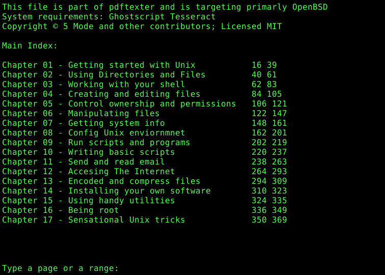

# pdftexter
A pdf textual reader for OpenBSD (script and web frontend) 
  
Acceptable script calls by shell:
 
pdftexter Unix1.pdf --  (call &lt;pdf&gt;.idx index if exists)  
pdftexter Unix1.pdf -- 10  
pdftexter Unix1.pdf -- 10 15  

Acceptable frontend calls:
 
http://myreader.puppy/web.php?pdf=Unix1.pdf  (call &lt;pdf&gt;.idx index if exists)  
http://myreader.puppy/web.php?pdf=Unix1.pdf&frompage=10  
http://myreader.puppy/web.php?pdf=Unix1.pdf&frompage=10&topage=15  

Script web call for debugging purpose:
 
t=`date "+%Y%m%d-%H%M%S"`; pdftexter Unix1.pdf $t 10 15

Hope you can find it somewhat useful. Have fun!  
 
For any need of software additions, plugins and improvements please write to <a href="mailto:info@5mode.com">info@5mode.com</a>    
 
To help please donate by clicking <a href="https://gaox.io/l/dona1">https://gaox.io/l/dona1</a> and filling the form.   
 
Screenshot:  

Feedback: <a href="mailto:code@gaox.io">code@gaox.io</a>
